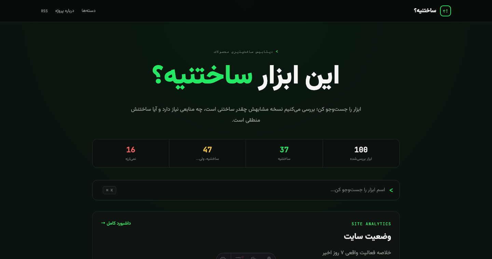

# ساختنیه؟ — Sakhtanie

قبل از اینکه بسازیش، ببین ساختنیه یا نه.

A Persian-language build-intelligence catalog that evaluates whether popular
digital products can realistically be rebuilt with AI, what their MVP requires,
and whether they are worth building.

The product and its primary content are currently available in Persian.

[Live Website](https://sakhtanie.ir) · [فارسی](#فارسی) · [Features](#features) · [Local Development](#local-development) · [Contributing](#contributing)

[](https://github.com/manny-py/sakhtanie/actions/workflows/ci.yml)




## What is Sakhtanie?

Sakhtanie is not a general AI tools directory. It examines digital products from a builder's point of view: what can be reproduced, what belongs in a realistic MVP, how much time and skill it may require, where complexity and external dependencies appear, what a smaller version cannot match, and whether building it has practical value.

Each published analysis reaches one of the verdicts used by the product:

- **ساختنیه (yes):** a useful version is realistically buildable.
- **ساختنیه، ولی… (kinda):** a narrower version is buildable, with meaningful limitations.
- **نمی‌ارزه (no):** recreating the product's central value is not a practical build target.

These are editorial feasibility estimates based on the catalog data. They are not scientific measurements, delivery guarantees, or substitutes for validating a specific product plan.

## Why it exists

AI has made it easier to start building software, but understanding the real scope is still difficult. Builders can underestimate authentication, storage, payments, realtime behavior, moderation, infrastructure, external services, and ongoing maintenance. Sakhtanie is designed to make those constraints visible before work begins.

## Features

The current source contains **100 published product analyses across 14 categories**. It provides:

- Product feasibility verdicts with a confidence level and rationale
- A buildable-version comparison and the parts likely to remain missing
- MVP direction through a core loop, main requirements, limitations, and starter prompt
- Time estimates and required skill levels
- Product and technical scores, including complexity, infrastructure, cost, dependency, risk, and value signals
- Suitable audiences and possible monetization models
- Related products, full-catalog search, category browsing, and verdict filters
- RSS, sitemap generation, structured data, and a Persian RTL interface

## Example analysis

The catalog's [ChatGPT analysis](src/data/apps/chatgpt.json) uses the `no` verdict with high confidence. It distinguishes a buildable Persian API-backed chat assistant from ChatGPT's core value:

- **Estimated MVP:** one weekend, intermediate skill level
- **Buildable version:** a focused AI assistant with a chat interface, conversation history, and limited capabilities
- **Main requirements:** an RTL streaming chat UI, backend conversation/session handling, and database-backed history and settings
- **Main gap:** no proprietary foundation model, training operation, global serving infrastructure, or complete multimodal/tooling stack
- **Technical complexity score:** 2/5

The source also records that the estimate depends on the selected external language-model service.

## Tech stack

- [Astro](https://astro.build/) for the static site and routes
- TypeScript with Astro's strict configuration
- Tailwind CSS through the Vite integration
- Zod schemas for catalog validation
- JSON-based product records under `src/data/apps/`
- Node's test runner, ESLint, and repository-specific validation and secret-scanning scripts

## Project structure

```text
.
├── .github/
│   ├── ISSUE_TEMPLATE/
│   └── workflows/
├── public/
│   └── app-logos/
├── scripts/
│   ├── lib/
│   ├── scan-secrets.mjs
│   └── validate-data.ts
├── src/
│   ├── components/
│   ├── data/apps/
│   ├── layouts/
│   ├── lib/
│   ├── pages/
│   └── styles/
└── tests/
```

## Local development

Node.js `>=22.12.0` is required by `package.json`. The repository's `.node-version` currently pins Node.js `24.18.0`.

```bash
git clone https://github.com/manny-py/sakhtanie.git
cd sakhtanie
npm install
npm run dev
```

Run the same core checks used by the project before opening a pull request:

```bash
npm run validate:data
npm test
npm run lint
npm run build
npm run scan:secrets
```

Optional public build-time settings are documented in [`.env.example`](.env.example). Never commit real credentials or private environment values.

## Contributing

Contributions can propose a catalog entry, correct an existing record or analysis, fix a bug, improve accessibility or documentation, and help prepare future translation infrastructure. Please keep pull requests small, focused, and supported by sources where a claim can change over time. Submission does not guarantee acceptance.

Read [CONTRIBUTING.md](CONTRIBUTING.md) for the workflow and validation requirements.

## Roadmap

- Expand the catalog while keeping its data schema consistent
- Improve analysis quality, sourcing, and reviewability
- Make the contribution workflow clearer and easier to validate
- Explore additional language support without committing to a release date

## Licensing

- Original software source code and configuration are licensed under the [MIT License](LICENSE).
- Original catalog entries, editorial analysis, and written documentation are licensed under [Creative Commons Attribution 4.0 International](CONTENT-LICENSE.md).
- The names “Sakhtanie” and “ساختنیه؟”, project logos, Social Preview artwork, distinctive brand graphics, and visual brand identity are excluded from both licenses unless explicit written permission is provided.
- Third-party product names, logos, screenshots, trademarks, and other intellectual property remain the property of their respective owners and are not relicensed by this Repository.

See [CONTENT-LICENSE.md](CONTENT-LICENSE.md) for the precise path-based scope, attribution guidance, and exclusions.

---

## فارسی

### ساختنیه چیست؟

ساختنیه یک فهرست معمولی از ابزارهای هوش مصنوعی نیست. این پروژه محصولات دیجیتال شناخته‌شده را از زاویهٔ دید سازنده بررسی می‌کند: آیا می‌شود نسخه‌ای کاربردی از آن‌ها ساخت، MVP منطقی‌شان چیست، چه مهارت و زمانی می‌خواهند، کجا به زیرساخت یا سرویس بیرونی وابسته‌اند و در نهایت ساختنشان چقدر ارزش دارد.

محصول و محتوای اصلی آن در حال حاضر فارسی است و رابط سایت به‌صورت راست‌به‌چپ طراحی شده.

### چه مشکلی را حل می‌کند؟

شروع ساخت محصول با کمک AI آسان‌تر شده، اما تخمین Scope واقعی هنوز ساده نیست. احراز هویت، ذخیره‌سازی، پرداخت، قابلیت‌های هم‌زمان، تعدیل محتوا، زیرساخت و هزینهٔ نگهداری معمولاً بیشتر از چیزی هستند که در نمونهٔ اولیه دیده می‌شود. ساختنیه تلاش می‌کند این بخش‌های پنهان را پیش از شروع کار روشن کند.

نتیجهٔ هر بررسی یکی از این سه حالت است: «ساختنیه»، «ساختنیه، ولی…» یا «نمی‌ارزه». این نتیجه‌ها برآورد تحلیلی‌اند، نه تضمین زمان، هزینه یا موفقیت محصول.

### برای هر محصول چه اطلاعاتی ارائه می‌شود؟

- نتیجهٔ امکان‌پذیری، میزان اطمینان و دلیل آن
- مقایسهٔ محصول اصلی با نسخه‌ای که واقعاً می‌شود ساخت
- چرخهٔ اصلی محصول، نیازمندی‌ها، محدودیت‌ها و Prompt شروع
- تخمین زمان و سطح مهارت لازم
- امتیازهای فنی و محصولی مثل پیچیدگی، زیرساخت، هزینه، وابستگی و ارزش
- مخاطبان مناسب، مدل‌های درآمدی احتمالی و ابزارهای مرتبط

فهرست فعلی شامل **۱۰۰ تحلیل منتشرشده در ۱۴ دسته** است. دادهٔ هر تحلیل به‌صورت JSON در مسیر [`src/data/apps/`](src/data/apps/) نگهداری و با Schema پروژه بررسی می‌شود.

### اجرای محلی

پروژه به Node.js نسخهٔ `22.12.0` یا جدیدتر نیاز دارد؛ نسخهٔ ثبت‌شده در `.node-version` برابر `24.18.0` است.

```bash
git clone https://github.com/manny-py/sakhtanie.git
cd sakhtanie
npm install
npm run dev
```

برای بررسی تغییرات:

```bash
npm run validate:data
npm test
npm run lint
npm run build
npm run scan:secrets
```

### روش مشارکت

می‌توانید ابزار تازه‌ای پیشنهاد کنید، داده یا تحلیل موجود را اصلاح کنید، باگ برطرف کنید یا مستندات و دسترس‌پذیری را بهتر کنید. برای ادعاها و اطلاعاتی که ممکن است تغییر کنند منبع معتبر ارائه دهید، هیچ Secret یا مقدار واقعی Environment را Commit نکنید و PR را کوچک و متمرکز نگه دارید. جزئیات در [راهنمای مشارکت](CONTRIBUTING.md) آمده است و ارسال تغییر به‌معنای پذیرش قطعی آن نیست.

### مجوزها

کد و تنظیمات نرم‌افزاری با [مجوز MIT](LICENSE) منتشر می‌شوند. محتوای اصلی Catalog، تحلیل‌های تحریریه و مستندات تألیفی تحت شرایط [CC BY 4.0](CONTENT-LICENSE.md) هستند. نام و هویت بصری ساختنیه و همچنین نام‌ها، لوگوها و مالکیت فکری اشخاص ثالث تحت این دو مجوز قرار نمی‌گیرند.

سایت اصلی: [sakhtanie.ir](https://sakhtanie.ir)
